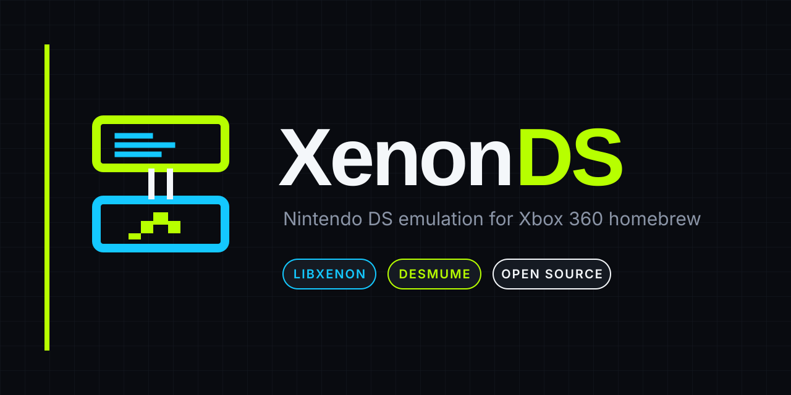

# XenonDS



XenonDS is an early open-source Nintendo DS emulator port for Xbox 360
homebrew. The project is designed around LibXenon and the DeSmuME emulation
core, with a long-term goal of a PowerPC dynamic recompiler.

> Status: foundation milestone. This repository does not yet run commercial
> games on an Xbox 360. It contains a tested portable core boundary, Nintendo
> DS ROM validator, initial DeSmuME adapter, and LibXenon hardware probe.

## Why this project exists

The existing DSon360 port is an abandoned proof of concept from 2010. Xbox 360
hardware should be capable of substantially better Nintendo DS emulation, but
the software needs a maintained frontend, careful profiling, and eventually a
PowerPC JIT.

## What works now

- Nintendo DS header parsing and Nintendo CRC16 validation
- ARM7/ARM9 executable range safety checks
- Emulator lifecycle and backend interface
- Native dual-screen frame, audio, button, and touch contracts
- Integer-scaled vertical, horizontal, and single-screen layouts
- Xbox-position controller mapping and right-stick touch cursor
- Tested BGR555-to-XRGB8888 conversion and nearest-neighbor compositor
- `xenonds-rominfo` command-line utility
- Deterministic host tests
- Initial source adapters for DeSmuME and LibXenon

## Host build

```bash
cmake -S . -B build -DCMAKE_BUILD_TYPE=Release
cmake --build build --parallel
ctest --test-dir build --output-on-failure
```

Inspect a legally dumped Nintendo DS image:

```bash
./build/xenonds-rominfo /path/to/game.nds
```

Generate a synthetic dual-screen compositor preview without a ROM:

```bash
./build/xenonds-layout-demo xenonds-layout-demo.ppm
```


The preview above is generated by the tested compositor and contains no game
content. It verifies color conversion, scaling, placement, and frame ordering.

## Upstream source setup

```bash
./scripts/fetch_upstreams.sh
```

The script checks out the exact DeSmuME and LibXenon revisions recorded in
`upstream.lock`. Upstream source is intentionally not vendored into this
repository.

## Hardware plan

The first Xbox artifact is `platform/xenon/xenonds-probe.elf32`. It initializes
video, USB, controller, ATA, and FAT services, providing a small real-hardware
test before the full DeSmuME source set is introduced. See `docs/ROADMAP.md`.

Build it on Windows with Docker Desktop:

```powershell
./scripts/build_xenon_probe.ps1
```

GitHub Actions also builds and retains the probe as a workflow artifact. The
artifact still requires a homebrew-capable console and XeLL for hardware testing.

## Legal notice

XenonDS contains no games, Nintendo BIOS/firmware, encryption keys, Microsoft
SDK files, or proprietary Xbox software. Use ROM images and firmware dumped
from hardware and games you own. DeSmuME integration makes this project
GPL-2.0 licensed; derived releases must provide corresponding source.
