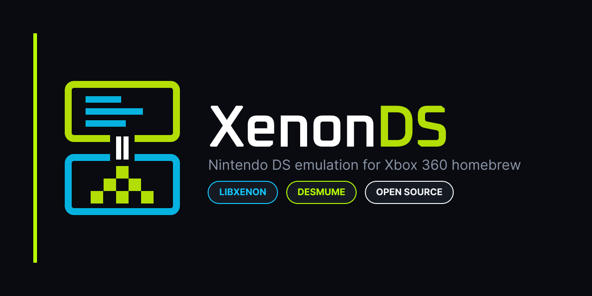
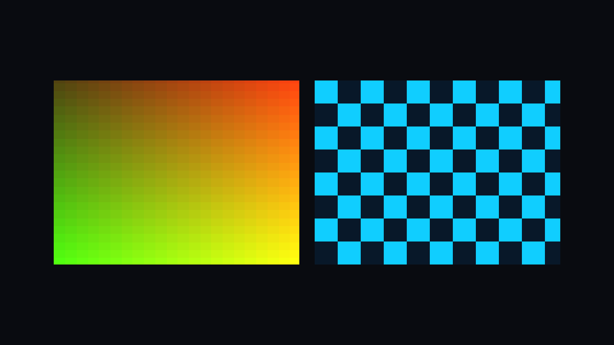

# XenonDS

<p align="center">
  
</p>

XenonDS is an open-source Nintendo DS emulator port for Xbox 360 homebrew.
It combines a portable frontend with LibXenon platform support and Nintendo DS
emulation cores adapted for the Xbox 360.

> **Project status:** Experimental. The v0.7 NooDS release candidate passes
> reproducible ARM, memory, input, direct-boot, and software-video tests on the
> host. Its Xbox frontend provides dual-screen video, controller/touch input,
> and persistent cartridge saves. The exact release ELF still needs its final
> Xbox hardware test; audio, a ROM browser, and broad compatibility testing are
> not included yet.

## Implemented

- Nintendo DS header parsing and CRC16 validation
- ARM7 and ARM9 executable-range validation
- Backend-neutral emulator lifecycle
- Dual-screen video, stereo audio, controller, and touch interfaces
- Vertical, horizontal, and single-screen layouts with integer scaling
- Xbox-position controller mapping and right-stick touch input
- BGR555-to-XRGB8888 conversion and nearest-neighbor composition
- Host-side tests and ROM information utility
- Initial DeSmuME adapter and LibXenon hardware probe
- On-console FAT device discovery and Nintendo DS ROM-header validation
- Statically linked DeSmuME interpreter checkpoint for LibXenon
- Direct software-framebuffer output for the two Nintendo DS screens
- On-console emulation and video-stage profiler
- NooDS direct-boot core with no proprietary BIOS requirement
- Persistent `.sav` loading and periodic/exit-time save flushing
- Asynchronous Xbox framebuffer presentation on a second hardware thread

## Build and test

```bash
cmake -S . -B build -DCMAKE_BUILD_TYPE=Release
cmake --build build --parallel
ctest --test-dir build --output-on-failure
```

Inspect a legally dumped Nintendo DS image:

```bash
./build/xenonds-rominfo /path/to/game.nds
```

Generate a synthetic dual-screen compositor image:

```bash
./build/xenonds-layout-demo xenonds-layout-demo.ppm
```



## Xbox 360 hardware probe

The LibXenon runtime probe in `platform/xenon` initializes video, USB,
controller, ATA, and FAT services, then validates the first `.nds` header it
finds in `XenonDS/`, `xenonds/`, or the root of a mounted FAT device. A
Docker-based Windows build script is included:

```powershell
./scripts/build_xenon_probe.ps1
```

Running the resulting `.elf32` file requires a homebrew-capable Xbox 360 and
XeLL. Copy only a legally dumped `.nds` image to the USB drive; this milestone
inspects metadata and does not execute the game yet.

## NooDS v0.7 release candidate

The current Xbox target uses a pinned and patched NooDS core. It boots the first valid
`.nds` file found in `XenonDS/`, `xenonds/`, or the root of a mounted FAT
device, renders both DS screens, maps all DS controls, and stores a `.sav` file
beside the ROM. It uses direct boot, so DS BIOS and firmware files are optional.

```powershell
Set-ExecutionPolicy -Scope Process Bypass
.\scripts\build_xenon_noods.ps1
```

The USB-ready output is `platform/xenon/release-noods/`. Preserve its folder
layout, add one legally dumped ROM as `XenonDS/game.nds`, boot XeLL, and press
**A** at the staged-loader prompt. See [Xbox 360 runtime testing](docs/XBOX_TESTING.md)
for controls and limitations.

The build prints ROM-preload progress for large games. After `Core ready`, it
only presents and paces newly completed DS frames; internal NooDS scheduler
slices are never mistaken for video frames. Invalid-instruction and prolonged
blank-frame watchdogs stop with ARM9/ARM7 diagnostics instead of endlessly
reloading XeLL.

GitHub Actions publishes three v0.7 artifacts from the same build: the
USB-ready runtime, unstripped debug symbols, and a corresponding-source archive
containing the exact pinned NooDS source used by the executable.

## Legacy DeSmuME performance checkpoint

The v0.4.1 build uses a small staged loader plus the pinned DeSmuME interpreter
core. The loader shows file-read progress and a moving memory-preparation bar,
then the core loads the first legal `.nds` image found on FAT storage and runs
it on the Xbox 360. Before gameplay it reports separate input, ARM interpreter,
frame-copy, and Xbox-video timings measured on the console.

```powershell
./scripts/build_xenon_desmume.ps1
```

The USB-ready output is `platform/xenon/release/`: `xenon.elf` belongs in the
drive root and `XenonDS/xenonds-core.elf32` stays inside the included folder.
This checkpoint uses the scalar interpreter and has no audio, save persistence,
or ROM browser yet. It keeps the proven v0.3.7 framebuffer path while measuring
where each frame spends its time. See [Xbox 360 runtime testing](docs/XBOX_TESTING.md) for the
complete layout and expected on-screen result.

## Upstream dependencies

```bash
./scripts/fetch_upstreams.sh
```

The script checks out the legacy DeSmuME and LibXenon revisions recorded in
`upstream.lock`. `scripts/fetch_noods.sh` checks out the pinned NooDS revision
and applies the Xbox compatibility patch without overwriting a modified local
checkout.

## Documentation

- [Architecture](docs/ARCHITECTURE.md)
- [Roadmap](docs/ROADMAP.md)
- [Xbox 360 runtime testing](docs/XBOX_TESTING.md)
- [Contributing](CONTRIBUTING.md)
- [Brand assets](branding/README.md)

## Legal

XenonDS does not include games, Nintendo BIOS or firmware files, encryption
keys, Microsoft SDK files, or proprietary Xbox software. Use ROM images and
firmware dumped from hardware and games you own. The legacy DeSmuME executable
is GPL-2.0; the NooDS executable is GPL-3.0-or-later. Shared XenonDS code is
GPL-2.0-or-later. Derived releases must preserve the applicable license and
provide corresponding source code.
