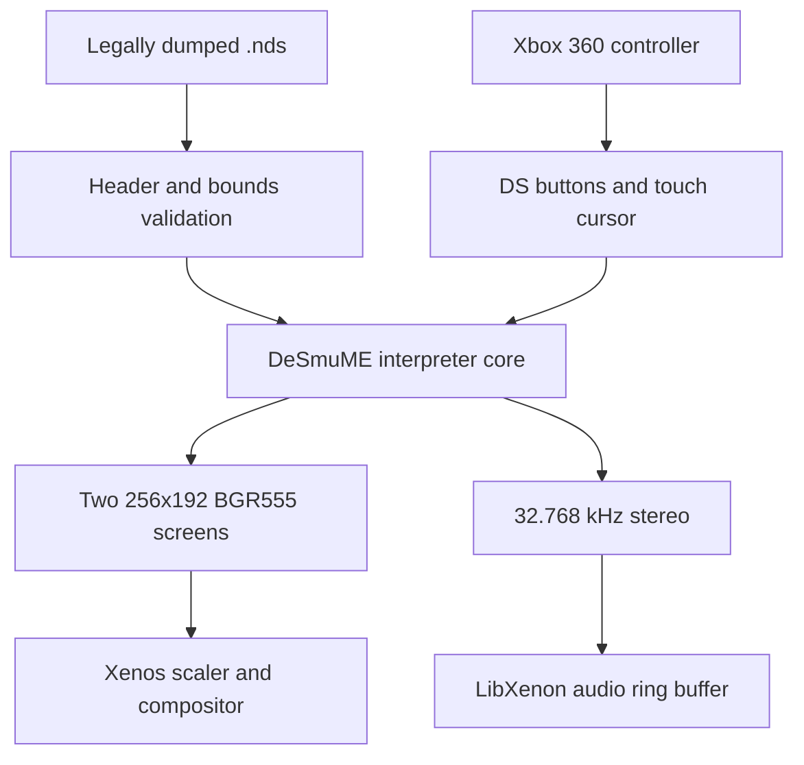

# XenonDS architecture

XenonDS separates the Nintendo DS emulation engine from the Xbox 360 platform
code. This keeps most logic testable on an ordinary computer and limits
hardware-specific work to small adapters.

## Layers

1. `xenonds_core` validates ROM metadata, owns the session lifecycle, defines
   native dual-screen frame and audio buffers, and sanitizes input.
2. `DesmumeBackend` translates the portable interface into upstream DeSmuME
   calls. Its first implementation runs the interpreter and software renderer.
3. The LibXenon platform layer supplies USB/FAT storage, controller input,
   Xenos video output, Xenon audio, timing, and eventually worker threads.
4. A future PowerPC JIT translates Nintendo DS ARM7/ARM9 basic blocks into
   Xenon instructions. This is the primary performance milestone.

## Initial data path

The software renderer is intentional for the first bootable release. A Xenos
3D renderer is useful only after correctness and CPU profiling are established.

